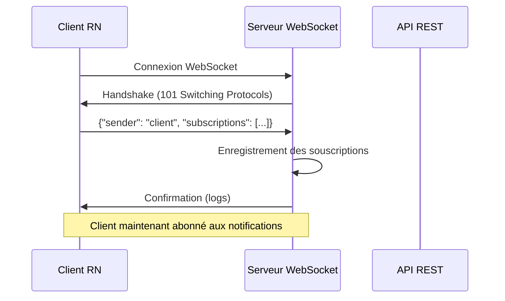
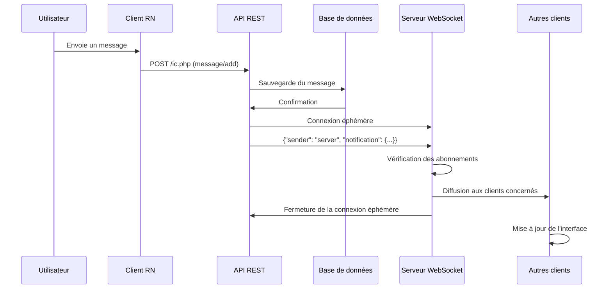
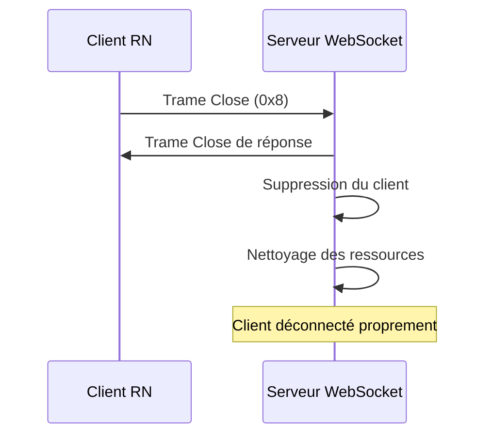
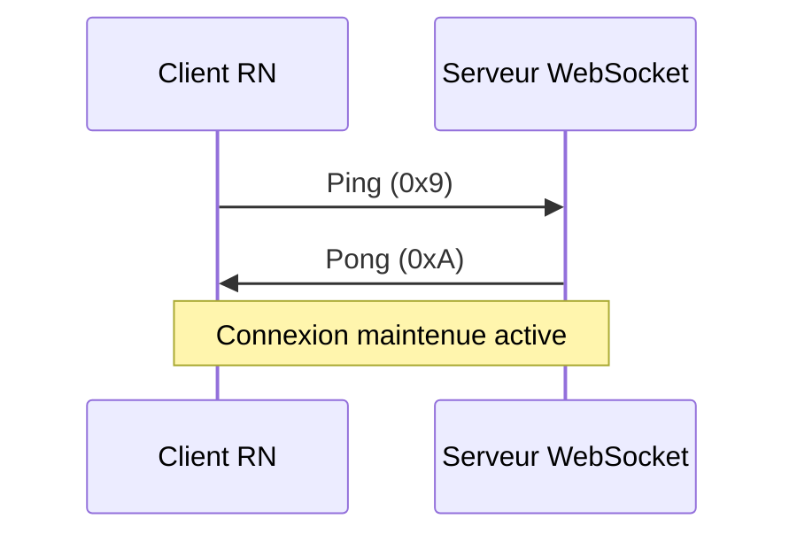
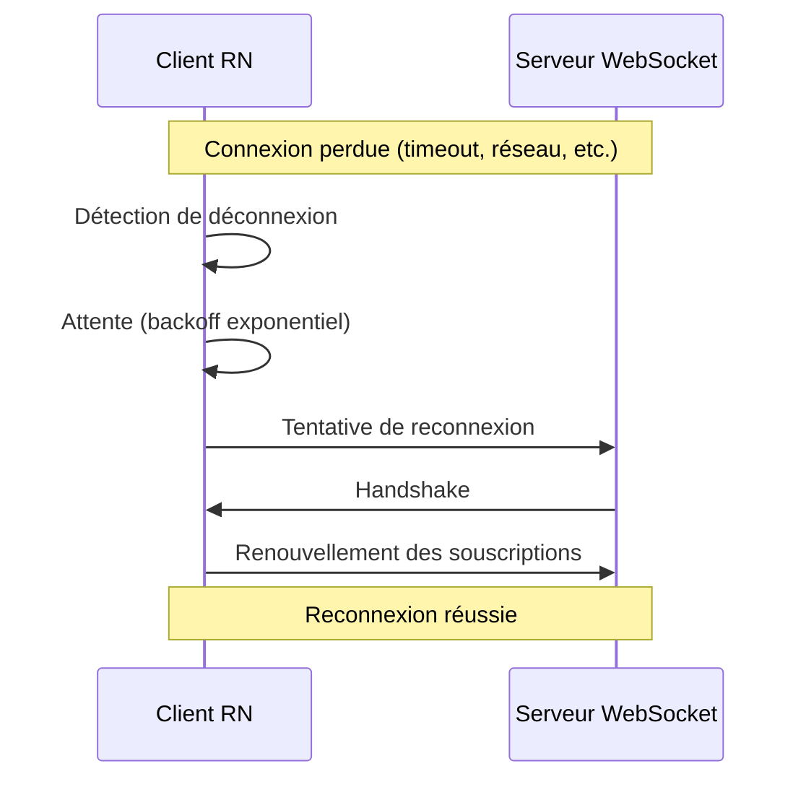
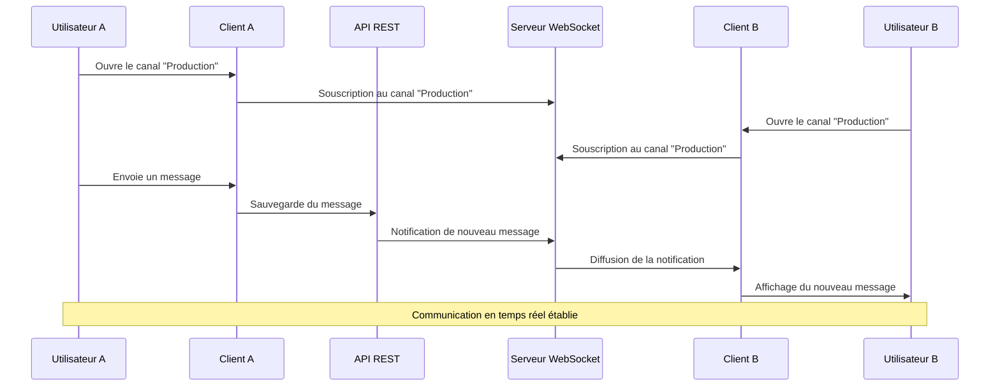

# Diagramme de séquence WebSocket

## 1. Connexion initiale et souscription

## 2. Envoi d'un message et notification

## 3. Gestion des déconnexions

## 4. Ping/Pong pour maintenir la connexion

## 5. Gestion des erreurs et reconnexion

## 6. Flux complet d'une session de messagerie

## Points clés du système

### 1. **Connexions persistantes**
- Les clients maintiennent une connexion WebSocket ouverte
- Permet la réception instantanée des notifications

### 2. **Souscriptions dynamiques**
- Les clients s'abonnent aux canaux qu'ils consultent
- Réduction du trafic réseau (pas de notifications inutiles)

### 3. **Connexions éphémères pour notifications**
- L'API crée une connexion temporaire pour envoyer des notifications
- Évite le couplage fort entre API et WebSocket

### 4. **Gestion robuste des erreurs**
- Reconnexion automatique côté client
- Nettoyage propre des ressources côté serveur
- Gestion des timeouts et déconnexions

### 5. **Performance optimisée**
- Diffusion ciblée (seuls les clients concernés reçoivent les notifications)
- Buffer intelligent pour les trames fragmentées
- Boucle non-bloquante avec timeout